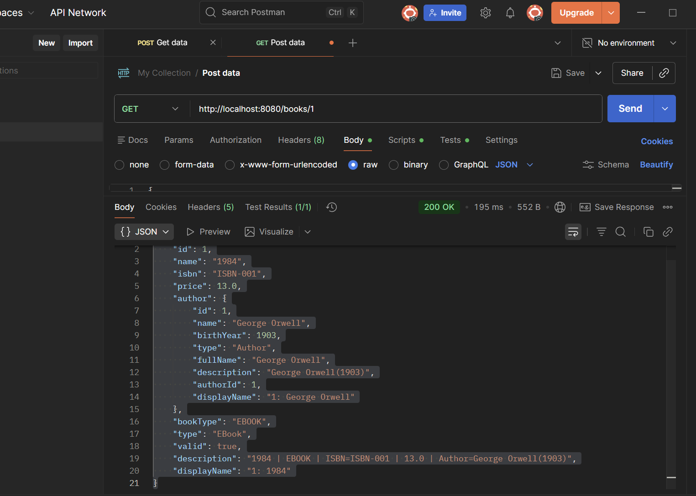
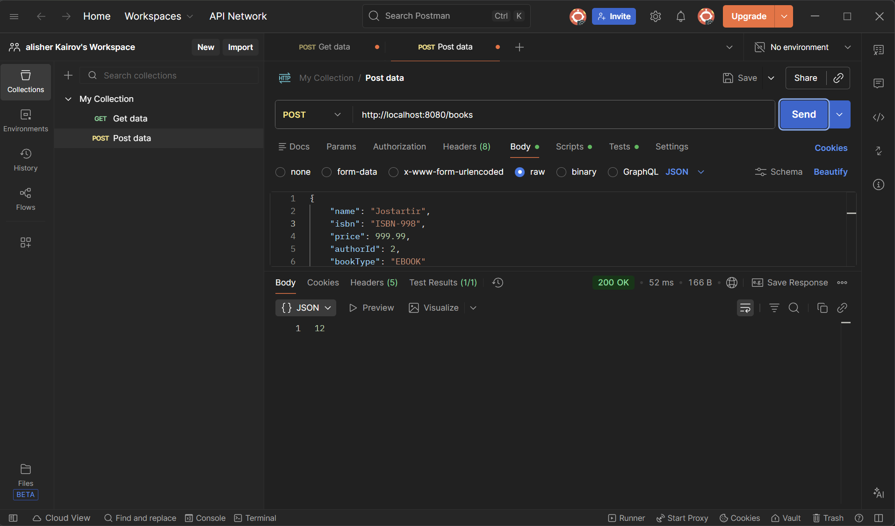
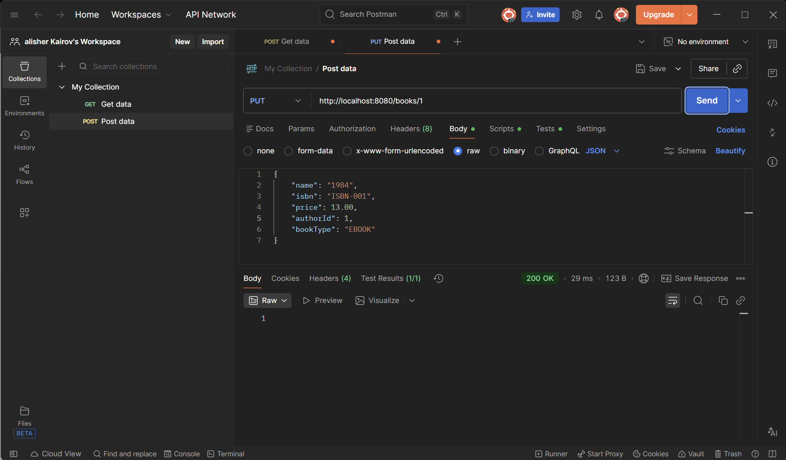
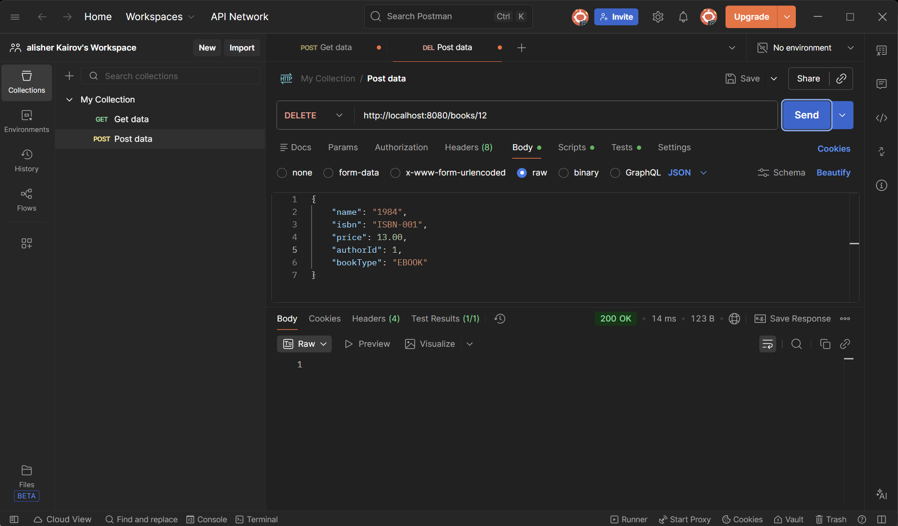

# A. Project Overview

This project is a SprintBoot RESTful API for a Library system. It provides CRUP operaions for books and uses MySQL as a database.

Architecture: 

`Controller -> Service -> Repository -> Database. `

Requests and responses use JSON format.


# B. REST API Documentation

### 1.Endpoint list

https://localhost:8080/books - Get all,Post(create)
https://localhost:8080/books/1 - Get by id,Put(Update),Delete


### 2.HTTP methods

```
Methods  |  Meaning   |   What it does
---------|------------|-----------------
GET      |   Read     |  Show data from the server
POST     |   Create   |  Creates a new book
PUT      |   Update   |  Updates an existing book
DELETE   |   Delete   |  Deletes a book from db
```


### 3.Sample JSON requests/responses

**Request to get by id:**

GET | https://localhost:8080/books/1


**Response to show 1 book:**
```
{
    "id": 1,
    "name": "1984",
    "isbn": "ISBN-001",
    "price": 13.0,
    "author": {
        "id": 1,
        "name": "George Orwell",
        "birthYear": 1903,
        "type": "Author",
        "fullName": "George Orwell",
        "description": "George Orwell(1903)",
        "authorId": 1,
        "displayName": "1: George Orwell"
    },
    "bookType": "EBOOK",
    "type": "EBook",
    "valid": true,
    "description": "1984 | EBOOK | ISBN=ISBN-001 | 13.0 | Author=George Orwell(1903)",
    "displayName": "1: 1984"
}
```

**Request create new book:**

POST | https://localhost:8080/books

Body -> raw 

JSON
```
{
    "name": "Jostartir",
    "isbn": "ISBN-998",
    "price": 999.99,
    "authorId": 2,
    "bookType": "EBOOK"
}
```
**Response:**
```
12
```

Why like this? Because it returns created new id.

**Request update:**

PUT | https://localhost:8080/books

JSON
```
{
    "name": "1984",
    "isbn": "ISBN-001",
    "price": 13.00,
    "authorId": 1,
    "bookType": "EBOOK"
}
```

**Response:**

```
1
```

Why like this? Because in Repository update has boolean type data. If data updated, then in response you would see 1.

Request Delete:

DELETE | https://localhost:8080/books/12

Response:

```
1
```
Same situation from update.


# Postman screenshots










# C. Design Patterns Section

## Purpose and usage of Singleton, Factory, Builder

### Singleton

Used for a single shared database configuration and connection manager across the application. This ensures one instance is user everywhere ( repositories , services)

### Factory

BookFactory creates subclasses of BookBase.
Depending on bookType, it returns:

`EBook`

`PrintedBook`

This keeps controller logic clean and makes it easy to add new book types.

### Builder

BookBuilder constructs complex Book objects using fluent methods. It supports optional fields and readable creation,user inside Factore and Service.


# D. Component Principles Section

### REP(Reuse/Release Equivalience)

Reusable parts are separated into packages:

- repository
- service
- patterns
- utils

### CCP(Common Closure Principle)

Classes that change together are grouped:

- REST-related classes are in `controller`
- Business rules are in `service`
- DB code is in `repository`

### CRP(Common Reuse Principle)

Higher layers depend only on what they use.

Controller depends on Service interfaces , now repository implementation details.

# E. SOLID & OOP Summary

S ( Single Responsibility): Controller handless HTTP, Service handles logic, Repository handles SQL and DB.

O (Open/Closed): Factory allows adding new book types with minimal changes.

L (Liskov Substituation): "EBook" and "PrintedBook" can be used as Bookbase

I (Interface Segregation): Repository or Service interfaces separate responsibolities.

D (Dependency Inversion): Controllers or Service depend on interfaces rather than concrete implementations.

# F. Database Schema

### Tables

**authors**
- author_id(PK)
- full_name
- birth_year

**books**
- book_id(PK)
- title
- isbn(UNIQUE)
- price
- book_type
- author_id(FK -> authors.author_id)

### Relationship

One author has many books(1:M).
books.author_id references authors.author_id.


# G. System Architecture Diagram

Client(Postman) 

↓ HTTP(JSON)

Controller(REST)

↓

Service(validation + business logic)

↓

Repository(JBDC or DB operations)

↓

MySQL Database


# H. Instructions to Run the Spring Boot Application

1)Configure database in src/main/resources/application.properties:

```
spring.datasource.url=jdbc:mysql://localhost:3306/DBNAME?useSSL=false&serverTimezone=UTC
spring.datasource.username=USERNAME
spring.datasource.password=PASSWORD
spring.datasource.driver-class-name=com.mysql.cj.jdbc.Driver

spring.jpa.hibernate.ddl-auto=update
spring.jpa.show-sql=true

```

2) Run the Spring Boot application:

Open EndtermApiApplication.java and click Run.

3) Test API in Postman:

Base URL: http://localhost:8080

Example: GET http://localhost:8080/books


# I. Reflection Section 

In this project , i migrated my old JBDC console application into a Spring Boot REST API. I implemented a layered architecture with Controllers, Services, and Repositories, and i tested all my CRUD endpoints using Postman. The main challenges were configuring Maven and the JDK correctly, setting up the database connection properties, and changing the old Scanner logic into REST endpoints with JSON requests and responses.

Through this proccess, i learned how Spring Boot maps HTTP request like GET and POST tot controller methods. I also learned how to structure code properly and how to use @RestControllerAdvice for global exception handling and proper HTTP status codes. Finally , i applied creational design patterns in a real way: I use Singleton for the database connection , a Factory to create EBook and Printedbook from request data , and the Builder pattern to create complex objects with a fluent API.